# Новая архитектура: UML в формате Mermaid

```mermaid
classDiagram
    namespace DomainEntity {
        class Author
        class Book
        class Subscription
        class BookAuthor
    }

    namespace DomainValueObject {
        class Id
        class AuthorName
        class BookTitle
        class PhotoName
        class PhoneNumber
    }

    namespace DomainPortRepository {
        class AuthorRepositoryInterface {
            <<interface>>
        }
        class BookRepositoryInterface {
            <<interface>>
        }
        class BookAuthorRepositoryInterface {
            <<interface>>
        }
        class SubscriptionRepositoryInterface {
            <<interface>>
        }
    }

    namespace DomainPortQuery {
        class BookQueryInterface {
            <<interface>>
        }
        class ReportQueryInterface {
            <<interface>>
        }
        class PhotoUrlGeneratorInterface {
            <<interface>>
        }
    }

    namespace ApplicationCommand {
        class CreateAuthorHandler
        class CreateBookHandler
        class UpdateBookHandler
        class SubscribeToAuthorHandler
        class SendNewBookSmsHandler
    }

    namespace ApplicationQuery {
        class SearchBooksHandler
        class TopAuthorsHandler
    }

    namespace ApplicationPortGateway {
        class TransactionManagerInterface {
            <<interface>>
        }
        class FileStorageInterface {
            <<interface>>
        }
        class NewBookNotifierInterface {
            <<interface>>
        }
        class SmsGatewayInterface {
            <<interface>>
        }
    }

    namespace InfrastructureHttp {
        class BookController
        class SubscriptionController
        class CreateBookAction
        class BookForm
        class SubscriptionForm
    }

    namespace InfrastructurePersistence {
        class BookRecord
        class BookMapper
        class BookRepository
        class SubscriptionRepository
        class BookQuery
        class ReportQuery
    }

    namespace InfrastructureGateway {
        class YiiTransactionManager
        class LocalFileStorage
        class WebPhotoUrlGenerator
        class YiiNewBookNotifier
        class SmsPilotGateway
    }

    namespace InfrastructureQueue {
        class SendNewBookSmsJob
    }

    %% Domain: сущности состоят из value object'ов, ActiveRecord отсутствует
    Book *-- BookTitle
    Book *-- PhotoName
    Author *-- AuthorName
    Subscription *-- PhoneNumber
    Book *-- Id

    %% Application зависит ТОЛЬКО от доменных портов и сущностей
    CreateAuthorHandler --> AuthorRepositoryInterface
    SubscribeToAuthorHandler --> AuthorRepositoryInterface
    SubscribeToAuthorHandler --> SubscriptionRepositoryInterface
    CreateBookHandler --> BookRepositoryInterface
    CreateBookHandler --> BookAuthorRepositoryInterface
    CreateBookHandler --> FileStorageInterface
    CreateBookHandler --> NewBookNotifierInterface
    CreateBookHandler --> TransactionManagerInterface
    UpdateBookHandler --> BookRepositoryInterface
    UpdateBookHandler --> TransactionManagerInterface
    SendNewBookSmsHandler --> SubscriptionRepositoryInterface
    SendNewBookSmsHandler --> SmsGatewayInterface
    SearchBooksHandler --> BookQueryInterface
    TopAuthorsHandler --> ReportQueryInterface

    %% Infrastructure реализует порты (стрелки направлены ВНУТРЬ, к домену/приложению)
    BookRepository ..|> BookRepositoryInterface
    SubscriptionRepository ..|> SubscriptionRepositoryInterface
    BookQuery ..|> BookQueryInterface
    ReportQuery ..|> ReportQueryInterface
    YiiTransactionManager ..|> TransactionManagerInterface
    LocalFileStorage ..|> FileStorageInterface
    WebPhotoUrlGenerator ..|> PhotoUrlGeneratorInterface
    YiiNewBookNotifier ..|> NewBookNotifierInterface
    SmsPilotGateway ..|> SmsGatewayInterface

    %% БД спрятана за репозиторием: только Infrastructure знает про ActiveRecord
    BookRepository --> BookMapper
    BookMapper --> BookRecord
    BookMapper --> Book

    %% HTTP-слой вызывает use case'ы, формы только валидируют ввод
    BookController ..> CreateBookAction
    CreateBookAction --> CreateBookHandler
    CreateBookAction ..> BookForm
    SubscriptionController --> SubscribeToAuthorHandler
    SubscriptionController ..> SubscriptionForm

    %% Очередь делегирует use case'у, а не делает работу сама
    YiiNewBookNotifier --> SendNewBookSmsJob
    SendNewBookSmsJob ..> SendNewBookSmsHandler
```



## Правило зависимостей

```text
Infrastructure -> Application -> Domain
```

Все стрелки направлены внутрь, к домену. Domain не знает ни про Yii, ни про ActiveRecord, ни про HTTP/файлы/очередь/SMSPilot, ни про глобальный `Yii::$app`.

## Выводы
1. Соответствует чистой архитектуре: каталоги разбиты по слоям `Domain` / `Application` / `Infrastructure`, а зависимости направлены внутрь (`Infrastructure → Application → Domain`).
2. Модели больше не связаны с БД через ActiveRecord: доменные сущности `Author`, `Book`, `Subscription`, `BookAuthor` — это чистый PHP с value objects, а ActiveRecord-классы (`BookRecord`, `AuthorRecord`, …) живут в `Infrastructure` и в домен не протекают.
3. Сущности используются только как домен; доступ к БД спрятан за интерфейсами репозиториев и запросов в `Domain` (`RepositoryInterface`, `QueryInterface`). `Application` зависит лишь от интерфейсов, реализации подключаются через DI-контейнер.
4. `SubscriptionForm` теперь занимается только валидацией формата телефона; проверка существования автора и уникальности подписки переехала в `SubscribeToAuthorHandler` и выполняется через `AuthorRepositoryInterface`/`SubscriptionRepositoryInterface` — явные зависимости вместо скрытого обращения к AR.
5. Слабая связанность позволяет unit-тестам полностью изолировать БД.
6. `BookForm` больше не сохраняет файлы — он только валидирует загруженный файл. Сохранение вынесено в интерфейс `FileStorageInterface` (реализация `LocalFileStorage`), имя файла — это VO `PhotoName`, а URL для представления строит `PhotoUrlGenerator` в `Infrastructure`.
7. Инфраструктура не протекает в `Application`: транзакции спрятаны за `TransactionManagerInterface`, а реализация `YiiTransactionManager` с `Yii::$app->db` находится в `Infrastructure`.
8. Ответственности джобы разделены: `SendNewBookSmsJob` лишь делегирует в `SendNewBookSmsHandler`, где поиск телефонов делает репозиторий, а отправку — `SmsGatewayInterface`.
9. DI полный и явный: зависимости приходят через конструкторы (`final readonly` классы), а глобальный `Yii::$app` и статические вызовы остались только в инфраструктурных адаптерах (`YiiTransactionManager`, `YiiNewBookNotifier`, `SendNewBookSmsJob`).
10. Чтение и запись разделены (CQS-стиль): команды идут через репозитории и доменные сущности, а выборки/отчёты — через отдельные `Query`-интерфейсы и read-модели (`BookView`, `TopAuthorRow`).
