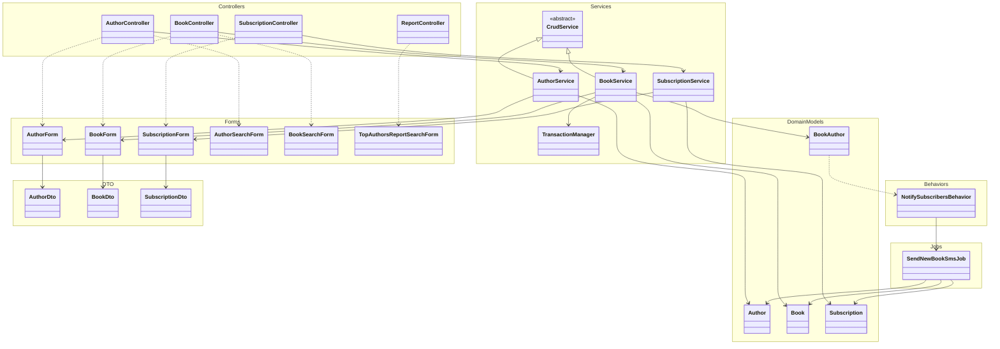

# Исходная архитектура: UML в формате Mermaid

## Выводы
1. Не соответствует слоистой архитектуре, другое распределение папок и ответственностей.
2. Модели связаны с бд за счет паттерна ActiveRecord.
3. Модели используются в сервисах и как Domain-сущности и как доступ к БД.
4. SubscriptionForm для валидации данных использует модель AR для доступа к БД, при этом не имеет явной зависимости.
5. Unit тесты при такой сильной связанности кода с БД, не позволяют изолировать БД.
6. BookForm помимо того, что занимается валидацией данных еще занимается сохранением файлов.
7. Infrastructure протекает в Application: TransactionManager использует Yii::$app→db, а BookService напрямую зависит от него.
8. Job смешивает ответственности - и находит подписчиков, и отправляет всем им смс.
9. DI частичный, внутри классов есть статические вызовы и глобальный Yii::$app.
